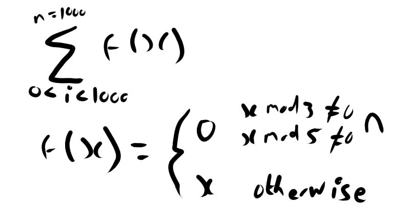

## Problem 1

### Description
If we list all the natural numbers below 10 that are multiples of 3 or 5, we get 3, 5, 6 and 9. The sum of these multiples is 23.

Find the sum of all the multiples of 3 or 5 below 1000.

### Solution
We need to essentially run a filter on the numbers from 1 to 999 to find the multiples. We can describe this operation mathematically as

Yielding an answer of 233168
