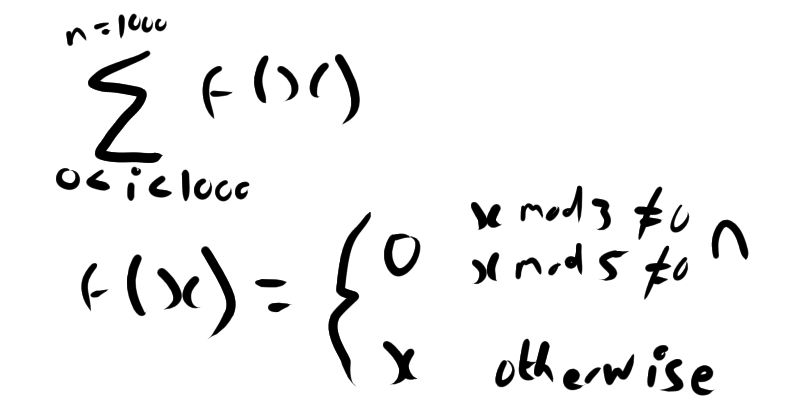

## Problem 2

### Description
Each new term in the Fibonacci sequence is generated by adding the previous two terms. By starting with 1 and 2, the first 10 terms will be:

1, 2, 3, 5, 8, 13, 21, 34, 55, 89, ...

By considering the terms in the Fibonacci sequence whose values do not exceed four million, find the sum of the even-valued terms.

### Solution
The algorithm for the fibonacci sequence is well-known. We need to essentially do the fibonacci algorithm, and form a set of the values
where the values are even and don't exceed four million. 

Yielding an answer of 
[2,8,34,144,610,2584,10946,46368,196418,832040,3524578]
