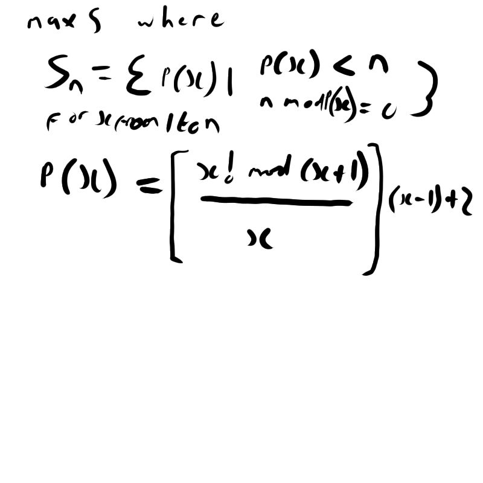

## Problem 3

### Description
The prime factors of 13195 are 5, 7, 13 and 29.
What is the largest prime factor of the number 600851475143 ?

### Solution
We can generate a set of prime factors for a number n by generating numbers x using Wilson's Theorem and ensuring x < n and n mod x = 0. Then we can simply take the maximum.

This solution can be mathematically expressed as

